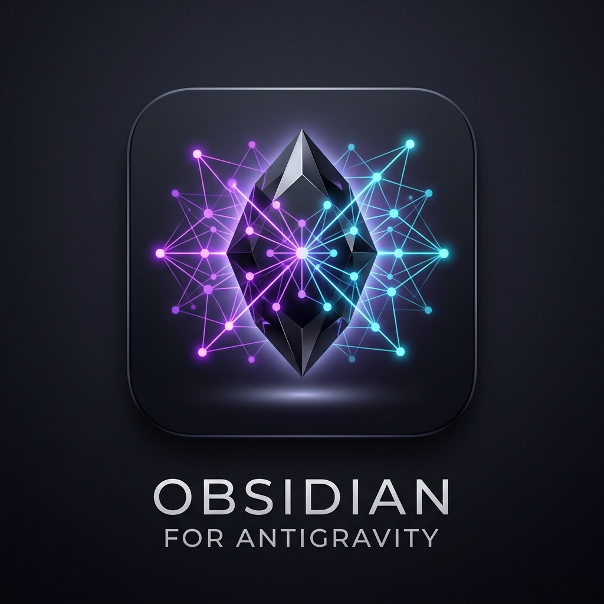

# 🧠 Obsidian for Antigravity

<p align="center">
  
</p>

<p align="center">
  <strong>Segundo Cerebro y Memoria Autónoma para tu Asistente de IA en Antigravity.</strong><br>
  La IA aprende de tus conversaciones, recuerda soluciones anteriores y registra arquitecturas y skills directamente en tu Vault local de Obsidian, conectándolo todo en tu Vista Gráfica (Graph View).
</p>

---

## 🌟 ¿Qué hace especial a Obsidian for Antigravity?

1. **🤖 Inteligencia y Aprendizaje Autónomo**:
   - **No necesitas decirle *"guarda esto"***: Cuando la IA resuelve un error difícil, diseña una arquitectura o descubre particularidades técnicas de tus proyectos, **lo sintetiza y guarda automáticamente** en `Antigravity/Memoria/`.
   - **Recuperación Proactiva**: Antes de asumir cómo funciona un proyecto o resolver un problema desde cero, la IA consulta primero tu bóveda para ver si ya lo solucionó en el pasado.

2. **⚡ Inyección Automática en TODOS los Chats**:
   - Al instalarse, la extensión registra automáticamente la regla global en `~/.gemini/config/rules/obsidian-brain.md` y la skill global en `~/.gemini/config/skills/antigravity-obsidian/`.
   - Cualquier modelo de IA en cualquier conversación sabe de inmediato que dispone de tu Segundo Cerebro.

3. **🔍 Zero-Configuración (Detección Automática)**:
   - Lee automáticamente la configuración de Obsidian (`%APPDATA%\obsidian\obsidian.json` en Windows, macOS y Linux).
   - Conecta con tu bóveda abierta en menos de 5 ms. Sin necesidad de tokens, APIs de pago ni servidores adicionales.

4. **🗺️ Vista Gráfica e Interconexión con Wikilinks `[[...]]`**:
   - Genera el mapa central **`00 Antigravity Hub.md`**.
   - Cada solución, skill y proyecto se conecta bidireccionalmente, haciendo que tu **Graph View de Obsidian** cobre vida y crezca orgánicamente.

5. **🔄 Sincronización Bidireccional de Skills**:
   - Todas tus skills de Antigravity (`~/.gemini/config/skills/`) se convierten en fichas interactivas en Obsidian. Si creas o editas una nota en Obsidian, Antigravity asimila los cambios.

6. **🌐 Deep-Links Nativos**:
   - Abre notas o el Hub directamente en la aplicación de escritorio de Obsidian con un solo clic (`obsidian://open`).

---

## 📂 Estructura en tu Bóveda de Obsidian

```text
📁 Antigravity/
├── 📄 00 Antigravity Hub.md        <-- Mapa central que ilumina el Grafo (MOC)
├── 📁 Memoria/                      <-- Soluciones a bugs, arquitecturas y trucos
│   ├── 00 Indice de Memoria.md
│   ├── Arquitectura Antigravity Obsidian Bridge.md
│   └── ...
├── 📁 Skills/                       <-- Catálogo completo de skills sincronizadas
│   ├── 00 Indice de Skills.md
│   └── ...
├── 📁 Proyectos/                    <-- Fichas técnicas de tus repositorios
│   └── ...
└── 📁 Sesiones/                     <-- Historial e hitos de trabajo
```

---

## 🚀 Inicio Rápido

1. Abre **Antigravity IDE**.
2. En la barra lateral izquierda (Activity Bar), haz clic en el icono **Obsidian for Antigravity**.
3. Verás tu bóveda detectada al instante: `🟢 Online — Obsidian Vault`.
4. Haz clic en **🔄 Sincronizar Bóveda Ahora**.
5. Abre **Obsidian** y disfruta de tu Segundo Cerebro interconectado.

---

## 🛠️ Comandos CLI de la Skill

La IA ejecuta internamente estos comandos en cualquier chat sin necesidad de servidores MCP:

```powershell
# Estado del Vault
node ~/.gemini/config/skills/antigravity-obsidian/scripts/obsidian.js status

# Búsqueda proactiva de memorias
node ~/.gemini/config/skills/antigravity-obsidian/scripts/obsidian.js search "termino_clave"

# Leer nota completa
node ~/.gemini/config/skills/antigravity-obsidian/scripts/obsidian.js read "NombreDeLaNota"

# Guardar memoria manualmente o por la IA
node ~/.gemini/config/skills/antigravity-obsidian/scripts/obsidian.js save-memory --title "Solución SQLite WAL" --summary "Uso de timeout y WAL" --content "Detalles paso a paso..."

# Abrir en la app de Obsidian
node ~/.gemini/config/skills/antigravity-obsidian/scripts/obsidian.js open "Antigravity/00 Antigravity Hub"
```

---

## 📦 Instalación

El archivo empaquetado `.vsix` está listo para instalar en cualquier Antigravity IDE / VS Code:
```bash
code --install-extension obsidian-for-antigravity-1.0.0.vsix
```

Desarrollado con ❤️ para la comunidad de Antigravity e investigadores de Inteligencia Artificial.
